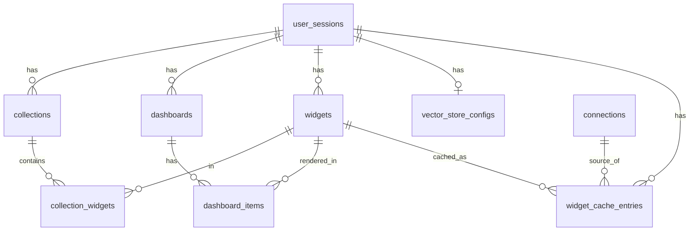

# Data Model: Feature 005

**Fecha**: 2026-04-24
**Storage**: SQLite secundaria (`backend/data/joi.db`) para metadata relacional. Vector store externo (Qdrant default o BYO vía LangChain) para embeddings; ese storage no tiene esquema SQL formal — se documenta como payload.

> Convenciones: todas las tablas llevan `id` UUID (string), `created_at`, `updated_at` (aware UTC). FKs con `ON DELETE CASCADE` salvo indicación contraria. `session_id` siempre referencia `user_sessions.id`.

---

## Entidades relacionales (SQLite)

### 1. `widgets` — [EXTENDED]

Tabla existente ([backend/app/models/widget.py](backend/app/models/widget.py)). Campos nuevos:

| Campo | Tipo | Nullable | Default | Nota |
|---|---|---|---|---|
| `is_saved` | BOOLEAN | NO | FALSE | Índice parcial `(session_id) WHERE is_saved = TRUE` |
| `display_name` | VARCHAR(120) | YES | NULL | UNIQUE `(session_id, display_name) WHERE is_saved = TRUE` |
| `saved_at` | DATETIME | YES | NULL | Se setea al pasar de `FALSE` → `TRUE` |

### 2. `collections`

| Campo | Tipo | Nullable | Default | Nota |
|---|---|---|---|---|
| `id` | VARCHAR(36) | NO | — | PK, UUID |
| `session_id` | VARCHAR(36) | NO | — | FK → `user_sessions.id` ON DELETE CASCADE |
| `name` | VARCHAR(80) | NO | — | UNIQUE `(session_id, name)` |
| `created_at` | DATETIME | NO | now() | |
| `updated_at` | DATETIME | NO | now() | |

### 3. `collection_widgets` — junction (Q3 N:M)

| Campo | Tipo | Nullable | Default | Nota |
|---|---|---|---|---|
| `collection_id` | VARCHAR(36) | NO | — | FK → `collections.id` ON DELETE CASCADE |
| `widget_id` | VARCHAR(36) | NO | — | FK → `widgets.id` ON DELETE CASCADE |
| `added_at` | DATETIME | NO | now() | |

**PK compuesta**: `(collection_id, widget_id)`. Índice secundario en `(widget_id)` para resolver "en cuántas colecciones está este widget".

### 4. `dashboards`

| Campo | Tipo | Nullable | Default | Nota |
|---|---|---|---|---|
| `id` | VARCHAR(36) | NO | — | PK UUID |
| `session_id` | VARCHAR(36) | NO | — | FK → `user_sessions.id` ON DELETE CASCADE |
| `name` | VARCHAR(120) | NO | — | UNIQUE `(session_id, name)` |
| `created_at` | DATETIME | NO | now() | |
| `updated_at` | DATETIME | NO | now() | Actualizar en cada cambio de layout |

### 5. `dashboard_items`

| Campo | Tipo | Nullable | Default | Nota |
|---|---|---|---|---|
| `id` | VARCHAR(36) | NO | — | PK UUID |
| `dashboard_id` | VARCHAR(36) | NO | — | FK → `dashboards.id` ON DELETE CASCADE |
| `widget_id` | VARCHAR(36) | NO | — | FK → `widgets.id` ON DELETE RESTRICT (no se borra el widget si aún está en un dashboard) |
| `grid_x` | INTEGER | NO | 0 | Columna inicial (grid 12 cols) |
| `grid_y` | INTEGER | NO | 0 | Fila inicial |
| `width` | INTEGER | NO | 4 | Columnas que ocupa (1–12) |
| `height` | INTEGER | NO | 3 | Filas que ocupa (≥1) |
| `z_order` | INTEGER | NO | 0 | Tiebreaker de render |

**Unicidad**: `(dashboard_id, widget_id)` — un widget no puede estar dos veces en el mismo dashboard (Edge Case asumido NO en el spec).

### 6. `widget_cache_entries`

Metadata local que **duplica** información también presente en el payload del vector store. Permite analíticas, invalidación por query SQL rápida, y recuperación aunque el provider esté caído.

| Campo | Tipo | Nullable | Default | Nota |
|---|---|---|---|---|
| `id` | VARCHAR(36) | NO | — | PK UUID; mismo id que el point en Qdrant |
| `session_id` | VARCHAR(36) | NO | — | FK → `user_sessions.id` ON DELETE CASCADE |
| `widget_id` | VARCHAR(36) | NO | — | FK → `widgets.id` ON DELETE CASCADE |
| `prompt_text` | TEXT | NO | — | Prompt canónico del usuario |
| `data_schema_hash` | VARCHAR(64) | NO | — | SHA-256 del schema JSON al momento del indexado |
| `connection_id` | VARCHAR(36) | NO | — | FK → `connections.id` ON DELETE SET NULL para trazabilidad post-borrado |
| `widget_type` | VARCHAR(32) | NO | — | Copia de `widgets.widget_type` |
| `hit_count` | INTEGER | NO | 0 | Incrementa en cada reuso aceptado |
| `last_used_at` | DATETIME | YES | NULL | |
| `invalidated_at` | DATETIME | YES | NULL | Soft-delete |
| `created_at` | DATETIME | NO | now() | |

Índices: `(session_id, invalidated_at)`, `(connection_id)`.

### 7. `vector_store_configs`

| Campo | Tipo | Nullable | Default | Nota |
|---|---|---|---|---|
| `id` | VARCHAR(36) | NO | — | PK UUID |
| `session_id` | VARCHAR(36) | NO | — | UNIQUE (una config por sesión) — FK ON DELETE CASCADE |
| `provider` | VARCHAR(32) | NO | — | Enum: `qdrant` \| `chroma` \| `pinecone` \| `weaviate` \| `pgvector` |
| `connection_params_encrypted` | BLOB | NO | — | JSON cifrado (reusar helper de `connections`) |
| `is_default` | BOOLEAN | NO | FALSE | TRUE solo si refiere al Qdrant interno sin config de usuario |
| `last_validated_at` | DATETIME | YES | NULL | Updated en ping exitoso |
| `created_at` | DATETIME | NO | now() | |
| `updated_at` | DATETIME | NO | now() | |

---

## Vector store (externo, gestionado vía LangChain)

### Colección / índice: `widget_cache`

- **Nombre**: Qdrant usa colección única `widget_cache`; Chroma/Pinecone/Weaviate/PGVector usan el nombre análogo (collection/index) documentado en la config.
- **Vector**: embedding de `prompt_text`, dim 1536 (cambia si se cambia `EMBEDDING_MODEL`).
- **Payload**: espejo de la tabla `widget_cache_entries` (mismos campos excepto el prompt_text completo se almacena también, para poder reconstruir sin ida a SQLite si el provider lo soporta).

### Filtros obligatorios en búsquedas

Toda llamada `similarity_search_with_score` incluye:
- `session_id == current_session.id`
- `invalidated_at IS NULL`
- `connection_id == current_connection.id`
- `data_schema_hash == current_schema_hash`

El límite es top-K=5 con corte por score ≥ 0.85 (Clarify Q2).

---

## Diagrama de relaciones (simplificado)

